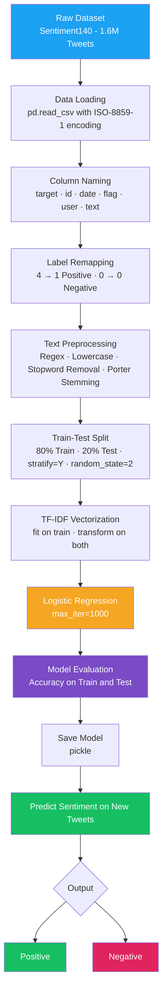

# 🐦 Twitter Sentiment Analysis using NLP


> Automatically classify tweets as **Positive** or **Negative** using Porter Stemming, TF-IDF vectorization, and Logistic Regression trained on 1.6 million tweets.

---

## 📌 Table of Contents

- [Overview](#-overview)
- [Demo](#-demo)
- [Architecture](#-system-architecture)
- [Dataset](#-dataset)
- [Tech Stack](#-tech-stack)
- [Installation](#-installation)
- [Usage](#-usage)
- [Results](#-results)
- [Limitations](#-limitations)
- [Future Scope](#-future-scope)

---

## 🧠 Overview

This project implements a complete end-to-end **Natural Language Processing (NLP)** pipeline for sentiment analysis on Twitter data. Given a tweet, the system predicts whether its sentiment is **positive** or **negative**.

The pipeline includes:
- Text cleaning using **regex**, **stopword removal**, and **Porter Stemming**
- Feature extraction using **TF-IDF Vectorization**
- Classification using **Logistic Regression**
- Model persistence using **Pickle**

---

## 🔗 Live Notebook

[](https://colab.research.google.com/drive/1h64fgF-N7sswRoOCF4WxJ4M7nNDSqbM7)

> Click the badge above to open and run the full notebook directly in Google Colab — no local setup required.

---

## 🎬 Demo

```python
# Load the saved model and vectorizer
import pickle
loaded_model = pickle.load(open('trained_model.sav', 'rb'))

# Predict on a sample from test set
X_new = X_test[200]
prediction = loaded_model.predict(X_new)

if prediction[0] == 0:
    print('Negative Tweet')
else:
    print('Positive Tweet')
# Output: Positive Tweet
```

> `1` = Positive &nbsp;|&nbsp; `0` = Negative

---

## 🏗️ System Architecture



---

## 📦 Dataset

**Sentiment140** — Stanford University / Kaggle

| Property | Details |
|---|---|
| Source | [Kaggle — Sentiment140](https://www.kaggle.com/datasets/kazanova/sentiment140) |
| Total Records | 1,600,000 tweets |
| Classes | 0 = Negative · 4 = Positive (remapped to 1) |
| Language | English |
| Format | CSV (zipped) |
| Encoding | ISO-8859-1 |
| Balance | 800K Negative + 800K Positive |

> ⚠️ Download the dataset from Kaggle and place `sentiment140.zip` in the working directory before running.

---

## 🛠️ Tech Stack

| Layer | Technology |
|---|---|
| Language | Python 3.8+ |
| Environment | Google Colab |
| Data Handling | pandas, numpy |
| Text Processing | nltk (stopwords), re, PorterStemmer |
| ML Framework | scikit-learn |
| Feature Extraction | TfidfVectorizer |
| Model | LogisticRegression |
| Evaluation | accuracy_score |
| Persistence | pickle |

---

## ⚙️ Installation

### 1. Clone the repository

```bash
git clone https://github.com/ARanjan45/NLP-TwitterSentimentAnalysis.git
cd NLP-TwitterSentimentAnalysis
```

### 2. Install dependencies

```bash
pip install numpy pandas scikit-learn nltk kaggle
```

### 3. Download the dataset

```bash
# Set up Kaggle API credentials first
mkdir -p ~/.kaggle
cp kaggle.json ~/.kaggle/
chmod 600 ~/.kaggle/kaggle.json

# Download dataset
kaggle datasets download -d kazanova/sentiment140
```

---

## 🚀 Usage

### Run via Google Colab

Open the notebook and run all cells top to bottom.

[](https://colab.research.google.com/drive/1h64fgF-N7sswRoOCF4WxJ4M7nNDSqbM7)

### Predict on Custom Tweets

```python
import pickle
from sklearn.feature_extraction.text import TfidfVectorizer
from nltk.stem.porter import PorterStemmer
from nltk.corpus import stopwords
import re, nltk

nltk.download('stopwords')
porter_stem = PorterStemmer()

def stemming(content):
    stemmed = re.sub('[^a-zA-Z]', ' ', content)
    stemmed = stemmed.lower().split()
    stemmed = [porter_stem.stem(w) for w in stemmed if w not in stopwords.words('english')]
    return ' '.join(stemmed)

# Load model
loaded_model = pickle.load(open('trained_model.sav', 'rb'))

# Transform and predict
tweet = "I love this so much!"
processed = stemming(tweet)
vec = vectorizer.transform([processed])
pred = loaded_model.predict(vec)
print("Positive" if pred[0] == 1 else "Negative")
```

---

## 📊 Results

| Split | Accuracy |
|---|---|
| Training Data | **79.87%** |
| Test Data | **77.67%** |

> Train/Test split: 1,280,000 / 320,000 tweets · `random_state=2` · `stratify=Y`

---

## ⚠️ Limitations

- **Single model only** — only Logistic Regression is implemented; no comparison with SVM or Naive Bayes
- **No neutral class** — tweets are strictly binary (positive/negative)
- **No deep learning** — transformer-based models (BERT, RoBERTa) would yield higher accuracy
- **Stemming over lemmatization** — Porter Stemmer can produce non-words; lemmatization would be more linguistically accurate
- **Dataset age** — Sentiment140 is from 2009; may not capture modern Twitter slang
- **Stemming is slow** — applying PorterStemmer to 1.6M tweets takes ~50 minutes

---

## 🔭 Future Scope

- [ ] Add Bernoulli Naive Bayes and Linear SVC for model comparison
- [ ] Implement BERT / RoBERTa for state-of-the-art accuracy
- [ ] Switch to lemmatization for cleaner text normalization
- [ ] Extend to 3-class classification (Positive / Neutral / Negative)
- [ ] Real-time tweet ingestion via Twitter/X API
- [ ] Deploy as a Flask or FastAPI web application
- [ ] Add model explainability using LIME or SHAP

---

## 🪪 License

This project is licensed under the [MIT License](LICENSE).
