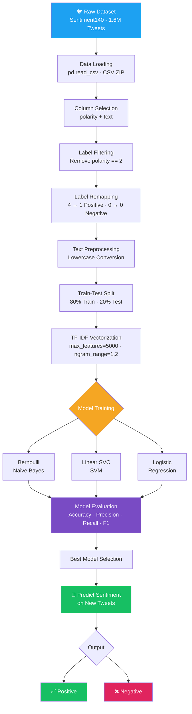

# 🐦 Twitter Sentiment Analysis using NLP


> Automatically classify tweets as **Positive** or **Negative** using TF-IDF vectorization and classical machine learning models trained on 1.6 million tweets.

---

## 📌 Table of Contents

- [Overview](#-overview)
- [Demo](#-demo)
- [Architecture](#-system-architecture)
- [Dataset](#-dataset)
- [Tech Stack](#-tech-stack)
- [Project Structure](#-project-structure)
- [Installation](#-installation)
- [Usage](#-usage)
- [Results](#-results)
- [Limitations](#-limitations)
- [Future Scope](#-future-scope)
- [References](#-references)

---

## 🧠 Overview

This project implements a complete end-to-end **Natural Language Processing (NLP)** pipeline for sentiment analysis on Twitter data. Given a tweet, the system predicts whether its sentiment is **positive** or **negative**.

Three machine learning classifiers are trained and compared:
- 🔵 **Bernoulli Naive Bayes**
- 🟠 **Linear Support Vector Machine (SVM)**
- 🟢 **Logistic Regression**

Text is converted to numerical features using **TF-IDF Vectorization** with unigrams and bigrams.

---

## 🔗 Live Notebook

[](https://colab.research.google.com/drive/1h64fgF-N7sswRoOCF4WxJ4M7nNDSqbM7#scrollTo=RUuQDFmyaS5S)

> Click the badge above to open and run the full notebook directly in Google Colab — no local setup required.

---

## 🎬 Demo

```python
sample_tweets = ["I love this!", "I hate that!", "It was okay, not great."]
sample_vec = vectorizer.transform(sample_tweets)

print("BernoulliNB :", bnb.predict(sample_vec))       # [1, 0, 0]
print("SVM         :", svm.predict(sample_vec))       # [1, 0, 0]
print("Logistic Reg:", logreg.predict(sample_vec))    # [1, 0, 0]
```

> `1` = Positive &nbsp;|&nbsp; `0` = Negative

---

## 🏗️ System Architecture

The full pipeline goes from raw tweets → preprocessing → vectorization → model training → sentiment prediction.



> 💡 Render this diagram locally using [mermaid.live](https://mermaid.live) or it will auto-render on GitHub.

---

## 📦 Dataset

**Sentiment140** — Stanford University / Kaggle

| Property | Details |
|---|---|
| Source | [Kaggle — Sentiment140](https://www.kaggle.com/datasets/kazanova/sentiment140) |
| Total Records | 1,600,000 tweets |
| Classes | 0 = Negative · 4 = Positive (remapped to 0 and 1) |
| Language | English |
| Format | CSV (zipped) |
| Balance | 800K Negative + 800K Positive |

> ⚠️ Download the dataset from Kaggle and place `training.1600000.processed.noemoticon.csv.zip` in the project root before running.

---

## 🛠️ Tech Stack

| Layer | Technology |
|---|---|
| Language | Python 3.8+ |
| Environment | Google Colab / Jupyter Notebook |
| Data Handling | pandas |
| ML Framework | scikit-learn |
| Feature Extraction | TfidfVectorizer |
| Models | BernoulliNB, LinearSVC, LogisticRegression |
| Evaluation | accuracy_score, classification_report |

---

## ⚙️ Installation

### 1. Clone the repository

```bash
git clone https://github.com/your-username/twitter-sentiment-analysis.git
cd twitter-sentiment-analysis
```

### 2. Create a virtual environment (optional but recommended)

```bash
python -m venv venv
source venv/bin/activate        # On Windows: venv\Scripts\activate
```

### 3. Install dependencies

```bash
pip install -r requirements.txt
```

**`requirements.txt`**
```
pandas
scikit-learn
numpy
```

### 4. Download the dataset

Download from [Kaggle — Sentiment140](https://www.kaggle.com/datasets/kazanova/sentiment140) and place the zip file in the `data/` directory.

---

## 🚀 Usage

### Run via Jupyter / Google Colab

Open `notebooks/twitter_sentiment_analysis.ipynb` and run all cells.

[](https://colab.research.google.com/drive/1h64fgF-N7sswRoOCF4WxJ4M7nNDSqbM7#scrollTo=RUuQDFmyaS5S)

### Run via Python Script

```python
import pandas as pd
from sklearn.feature_extraction.text import TfidfVectorizer
from sklearn.model_selection import train_test_split
from sklearn.naive_bayes import BernoulliNB
from sklearn.linear_model import LogisticRegression
from sklearn.svm import LinearSVC
from sklearn.metrics import accuracy_score, classification_report

# Load dataset
df = pd.read_csv('data/training.1600000.processed.noemoticon.csv.zip',
                 encoding='latin-1', header=None)
df = df[[0, 5]]
df.columns = ['polarity', 'text']

# Filter and remap labels
df = df[df.polarity != 2]
df['polarity'] = df['polarity'].map({0: 0, 4: 1})

# Preprocess
df['clean_text'] = df['text'].apply(lambda x: x.lower())

# Split
X_train, X_test, y_train, y_test = train_test_split(
    df['clean_text'], df['polarity'], test_size=0.2, random_state=42)

# Vectorize
vectorizer = TfidfVectorizer(max_features=5000, ngram_range=(1, 2))
X_train_tfidf = vectorizer.fit_transform(X_train)
X_test_tfidf  = vectorizer.transform(X_test)

# Train & Evaluate
for name, model in [("BernoulliNB", BernoulliNB()),
                    ("SVM", LinearSVC(max_iter=1000)),
                    ("Logistic Regression", LogisticRegression(max_iter=100))]:
    model.fit(X_train_tfidf, y_train)
    preds = model.predict(X_test_tfidf)
    print(f"\n{name} Accuracy: {accuracy_score(y_test, preds):.4f}")
    print(classification_report(y_test, preds))
```

### Predict on Custom Tweets

```python
tweets = ["Python is amazing!", "I can't stand this traffic."]
vecs   = vectorizer.transform([t.lower() for t in tweets])
print(model.predict(vecs))   # [1, 0]
```

---

## 📊 Results

| Model | Accuracy | Precision | Recall | F1-Score |
|---|---|---|---|---|
| Bernoulli Naive Bayes | ~77–78% | ~0.78 | ~0.77 | ~0.77 |
| **Linear SVC (SVM)** | **~82–83%** | **~0.83** | **~0.82** | **~0.82** |
| Logistic Regression | ~80–81% | ~0.81 | ~0.80 | ~0.80 |

> 🏆 **Best Model: Linear SVC (SVM)** — highest accuracy and F1-score across both classes.

### Sample Predictions

| Tweet | BNB | SVM | LogReg |
|---|---|---|---|
| "I love this!" | ✅ Positive | ✅ Positive | ✅ Positive |
| "I hate that!" | ❌ Negative | ❌ Negative | ❌ Negative |
| "It was okay, not great." | ❌ Negative | ❌ Negative | ❌ Negative |

---

## ⚠️ Limitations

- **Basic preprocessing only** — no stopword removal, stemming, or URL stripping
- **No neutral class** — tweets are strictly binary (positive/negative)
- **No deep learning** — transformer-based models (BERT, RoBERTa) would yield higher accuracy
- **Static vocabulary** — TF-IDF capped at 5,000 features may miss domain-specific terms
- **Dataset age** — Sentiment140 is from 2009; may not capture modern Twitter slang

---

## 🔭 Future Scope

- [ ] Add advanced text preprocessing (emoji handling, lemmatization, hashtag segmentation)
- [ ] Implement BERT / RoBERTa for state-of-the-art accuracy
- [ ] Extend to 3-class classification (Positive / Neutral / Negative)
- [ ] Real-time tweet ingestion via Twitter/X API
- [ ] Deploy as a Flask or FastAPI web application
- [ ] Add model explainability using LIME or SHAP


---

## 🪪 License

This project is licensed under the [MIT License](LICENSE).

---
